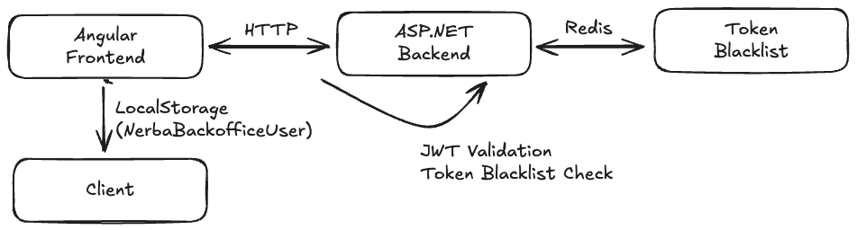

# Authentication and Authorization

This document describes the JWT authentication system and authorization implemented in NERBA Backoffice, including validations, business rules, components, and security flows.

## Table of Contents

- [Overview](#overview)
- [Authentication Validations](#authentication-validations)
- [Authentication Business Rules](#authentication-business-rules)
- [Authorization (Roles and Policies)](#authorization-roles-and-policies)
- [System Components](#system-components)
- [Authentication Flows](#authentication-flows)
- [Security](#security)
- [API Endpoints](#api-endpoints)
- [JWT Structure](#jwt-structure)
- [References](#references)

---

## Overview

NERBA Backoffice implements JWT (JSON Web Token) based authentication for secure communication between the Angular frontend and ASP.NET Core backend.

### Technology Stack

| Layer | Technology | Version |
|-------|------------|---------|
| Frontend | Angular (Standalone Components) | 19 |
| Backend | ASP.NET Core | 8+ |
| JWT Library (Frontend) | jwt-decode | - |
| Storage (Frontend) | LocalStorage | - |
| Cache (Backend) | Redis Distributed Cache | - |
| State Management | RxJS BehaviorSubject | - |

### High-Level Architecture



---

## Authentication Validations

### LoginDto (Backend)

| Field | Validations | Error Message |
|-------|-------------|---------------|
| `UsernameOrEmail` | Required | Default DataAnnotations validation |
| `Password` | Required | Default DataAnnotations validation |

### UserRoleDto (Backend)

| Field | Validations | Error Message |
|-------|-------------|---------------|
| `Roles` | Required, minimum 1 item | "At least 1 role is required." |
| `UserId` | Required | Default DataAnnotations validation |

### Login Model (Frontend)

| Field | Validations | Behavior |
|-------|-------------|----------|
| `usernameOrEmail` | Required | Form invalid if empty |
| `password` | Required | Form invalid if empty |

### Token Validation (Frontend)

| Validation | Description | Behavior |
|------------|-------------|----------|
| JWT Format | Token must have 3 parts separated by `.` | Decoding error |
| Expiration | `exp` claim validated with 5-second buffer | Token considered expired |
| Required claims | `nameid`, `email`, `role`, `exp` | Decoding error |

---

## Authentication Business Rules

### JWT Token

| Rule | Description | Layer |
|------|-------------|-------|
| Configurable expiration | Tokens expire after X days (configuration `JWT:ExpiresInDays`) | Backend |
| Standard claims | `nameid`, `email`, `given_name`, `family_name`, `role` | Backend |
| Algorithm | HMAC SHA256 Signature | Backend |
| Clock skew | 5 seconds tolerance for expiration | Frontend |
| Issuer | Configured in `JWT:Issuer` | Backend |

### Token Refresh

| Rule | Description | Layer |
|------|-------------|-------|
| Endpoint | GET `/api/auth/refresh-user-token` | Backend |
| Authentication | Requires valid token (Bearer) | Backend |
| Policy | Requires active user (`ActiveUser`) | Backend |
| Duplicate prevention | `isRefreshing` flag prevents multiple calls | Frontend |
| Automatic retry | Original request retried after successful refresh | Frontend |

### Logout and Invalidation

| Rule | Description | Layer |
|------|-------------|-------|
| Redis Blacklist | Token added to blacklist with key `blacklist:token:{token}` | Backend |
| Automatic TTL | Token removed from blacklist after natural expiration | Backend |
| Fail-secure | On Redis error, access denied | Backend |
| Client-side | LocalStorage cleared immediately | Frontend |
| Fire-and-forget | Client-side logout doesn't wait for server response | Frontend |

### Login

| Rule | Description | Layer |
|------|-------------|-------|
| Flexible authentication | Accepts username or email | Backend |
| Blocked user | Returns 401 if `IsActive = false` | Backend |
| Last login | System automatically updates `LastLogin` | Backend |
| Storage | User object (with JWT) stored in LocalStorage | Frontend |

---

## Authorization (Roles and Policies)

### Available Roles

| Role | Description | Permissions |
|------|-------------|-------------|
| `Admin` | System administrator | Full access, user and role management |
| `User` | Basic user | Access to standard features |
| `CQ` | Quality Coordinator | Training quality management |
| `FM` | Finance Manager | Financial management and payments |

### Policies

| Policy | Description | Implementation |
|--------|-------------|----------------|
| `ActiveUser` | Requires user with `IsActive = true` | `ActiveUserHandler` + `ActiveUserRequirement` |

### Role Verification (Frontend)

| Property | Description | Logic |
|----------|-------------|-------|
| `userRoles` | Array of user roles | Extracted from JWT `role` claim |
| `isUserAdmin` | Indicates if user is Admin | `role.includes('Admin')` |

---

## System Components

### Frontend (Angular)

| Component | File | Responsibility |
|-----------|------|----------------|
| AuthService | `core/services/auth.service.ts` | Authentication, token and state management |
| AuthGuard | `shared/guards/auth.guard.ts` | Authenticated route protection |
| UnauthOnlyGuard | `shared/guards/unauth-only.guard.ts` | Routes only for unauthenticated users |
| AuthInterceptor | `shared/interceptors/auth.interceptor.ts` | Automatic Bearer token injection |
| TokenRefreshInterceptor | `shared/interceptors/token-refresh.interceptor.ts` | Automatic renewal on 401 |
| User Model | `core/models/user.ts` | Authenticated user model |
| Login Model | `core/models/login.ts` | Login credentials model |
| JwtPayload Model | `core/models/jwtPayload.ts` | JWT claims structure |

### Backend (ASP.NET Core)

| Component | File | Responsibility |
|-----------|------|----------------|
| AuthController | `Core/Authentication/Controllers/AuthController.cs` | Authentication endpoints |
| JwtService | `Core/Authentication/Services/JwtService.cs` | Token generation and validation |
| TokenBlacklistService | `Core/Authentication/Services/TokenBlacklistService.cs` | Redis blacklist management |
| TokenBlacklistMiddleware | `Shared/Middleware/TokenBlacklistMiddleware.cs` | Blacklist verification on requests |
| ActiveUserHandler | `Core/Authentication/Models/ActiveUserHandler.cs` | ActiveUser policy handler |
| LoginDto | `Core/Authentication/Dtos/LoginDto.cs` | Login DTO |
| LoggedInUserDto | `Core/Authentication/Dtos/LoggedInUserDto.cs` | Login response DTO |
| UserRoleDto | `Core/Authentication/Dtos/UserRoleDto.cs` | Role assignment DTO |

---

## Authentication Flows

### Login Flow

```
1. User submits credentials (usernameOrEmail + password)
   |
2. Frontend: POST /api/auth/login
   |
3. Backend: Validates credentials
   |-- User not found -> 400 Bad Request
   |-- User blocked -> 401 Unauthorized
   |-- Invalid password -> 400 Bad Request
   |
4. Backend: Generates JWT with claims
   |
5. Backend: Updates LastLogin
   |
6. Frontend: Stores User in LocalStorage
   |
7. Frontend: Emits new state via BehaviorSubject
   |
8. Frontend: Redirects to dashboard (or returnUrl)
```

### Token Refresh Flow

```
1. Request returns 401 Unauthorized
   |
2. TokenRefreshInterceptor catches error
   |-- Is auth endpoint? -> Propagate error
   |
3. Checks isRefreshing flag
   |-- Already refreshing? -> Return
   |
4. GET /api/auth/refresh-user-token
   |
5. Backend: Validates current token
   |-- Invalid token -> 401 (logout on frontend)
   |
6. Backend: Generates new JWT
   |
7. Frontend: Stores new token
   |
8. Frontend: Retries original request with new token
```

### Logout Flow

```
1. User clicks logout
   |
2. Frontend: POST /api/auth/logout (fire-and-forget)
   |
3. Backend: Extracts token from header
   |
4. Backend: Decodes token to get expiration
   |
5. Backend: Adds to Redis blacklist
   |-- Key: blacklist:token:{jwt}
   |-- TTL: Until token natural expiration
   |
6. Frontend: Clears LocalStorage (immediate)
   |
7. Frontend: Emits null via BehaviorSubject
   |
8. Frontend: Redirects to login
```

### Application Load Flow

```
1. Application starts
   |
2. AuthService: loadUserFromStorage()
   |
3. Reads LocalStorage (NerbaBackofficeUser)
   |-- No data? -> Emits null
   |
4. Validates token expiration
   |-- Expired? -> removeUser() + Emits null
   |
5. Valid token -> Emits user via BehaviorSubject
```

---

## Security

### Implemented Measures

| Measure | Description | Status |
|---------|-------------|--------|
| Stateless JWT | Scalable authentication without server sessions | Implemented |
| Server-side logout | Redis blacklist for invalidation | Implemented |
| Automatic token refresh | Transparent renewal on 401 | Implemented |
| Route guards | Angular route protection | Implemented |
| Bearer token injection | Automatic interceptor | Implemented |
| Clock skew tolerance | 5 seconds tolerance | Implemented |
| Duplicate refresh prevention | isRefreshing flag | Implemented |
| Fail-secure blacklist | Denies access on Redis errors | Implemented |
| ActiveUser policy | Verifies active user in DB | Implemented |

### Known Vulnerabilities and Mitigations

| Vulnerability | Risk | Recommended Mitigation | Status |
|---------------|------|------------------------|--------|
| LocalStorage (XSS) | High | Migrate to HttpOnly cookies | Pending |
| Console logs in production | Low | Remove or condition by environment | Pending |
| CSRF | Medium | Implement CSRF tokens or SameSite cookies | Pending |
| Token without format validation | Low | Validate structure before storing | Pending |
| Hardcoded role names | Low | Centralize in enum/constants | Pending |

### Future Recommendations

| Recommendation | Priority | Description |
|----------------|----------|-------------|
| HttpOnly Cookies | High | Store JWT in secure cookies |
| Refresh Token Pattern | Medium | Short-lived access token + long-lived refresh token |
| Session Timeout Warning | Low | Warn user before expiration |
| Role-based Guards | Medium | Role-specific guards |
| Security Headers | Medium | X-Content-Type-Options, X-Frame-Options, CSP |

---

## API Endpoints

| Method | Endpoint | Description | Authentication | Authorization |
|--------|----------|-------------|----------------|---------------|
| POST | `/api/auth/login` | User authentication | No | - |
| POST | `/api/auth/logout` | Logout and token invalidation | Yes (Bearer) | ActiveUser |
| GET | `/api/auth/refresh-user-token` | Refresh JWT token | Yes (Bearer) | ActiveUser |
| POST | `/api/auth/set-role` | Assign roles to user | Yes (Bearer) | Admin + ActiveUser |

### HTTP Responses

| Code | Description | Scenarios |
|------|-------------|-----------|
| 200 | Success | Successful login/logout/refresh |
| 400 | Bad Request | Invalid credentials, validation failed |
| 401 | Unauthorized | Invalid/expired token, blocked user, blacklisted token |
| 404 | Not Found | User not found (refresh) |
| 500 | Internal Error | Unexpected error |

---

## JWT Structure

### Standard Claims

| Claim | .NET Type | Description | Example |
|-------|-----------|-------------|---------|
| `nameid` | ClaimTypes.NameIdentifier | Unique user ID | `"guid-xxx-xxx"` |
| `email` | ClaimTypes.Email | User email | `"user@example.com"` |
| `given_name` | ClaimTypes.GivenName | First name | `"John"` |
| `family_name` | ClaimTypes.Surname | Last name | `"Doe"` |
| `role` | ClaimTypes.Role | Array of roles | `["Admin", "User"]` |
| `exp` | - | Expiration Unix timestamp | `1735234567` |

### Frontend Structure (JwtPayload)

```typescript
interface JwtPayload {
  nameid: string;        // User ID
  email: string;         // Email
  given_name: string;    // First name
  family_name: string;   // Last name
  role: Array<string>;   // Roles (can be string if only 1)
}
```

### User Structure (Frontend)

```typescript
type User = {
  firstName: string;
  lastName: string;
  jwt: string;
};
```

---

## References

### Source Code Files

**Backend:**
- `NERBABO.Backend/NERBABO.ApiService/Core/Authentication/Controllers/AuthController.cs`
- `NERBABO.Backend/NERBABO.ApiService/Core/Authentication/Services/JwtService.cs`
- `NERBABO.Backend/NERBABO.ApiService/Core/Authentication/Services/TokenBlacklistService.cs`
- `NERBABO.Backend/NERBABO.ApiService/Shared/Middleware/TokenBlacklistMiddleware.cs`
- `NERBABO.Backend/NERBABO.ApiService/Core/Authentication/Models/ActiveUserHandler.cs`
- `NERBABO.Backend/NERBABO.ApiService/Core/Authentication/Dtos/`

**Frontend:**
- `NERBABO.Frontend/src/app/core/services/auth.service.ts`
- `NERBABO.Frontend/src/app/shared/guards/auth.guard.ts`
- `NERBABO.Frontend/src/app/shared/guards/unauth-only.guard.ts`
- `NERBABO.Frontend/src/app/shared/interceptors/auth.interceptor.ts`
- `NERBABO.Frontend/src/app/shared/interceptors/token-refresh.interceptor.ts`
- `NERBABO.Frontend/src/app/core/models/`
- `NERBABO.Frontend/src/app/core/objects/apiEndpoints.ts`

### External Resources

> Ref: [Angular Security Guide](https://angular.dev/best-practices/security)

> Ref: [JWT Best Practices - RFC 8725](https://tools.ietf.org/html/rfc8725)

> Ref: [OWASP Authentication Cheat Sheet](https://cheatsheetseries.owasp.org/cheatsheets/Authentication_Cheat_Sheet.html)

> Ref: [jwt-decode Library](https://github.com/auth0/jwt-decode)

> Ref: [ASP.NET Core Authentication](https://learn.microsoft.com/en-us/aspnet/core/security/authentication/)

### Related Documentation

> See: [Entity Validations](./VALIDATIONS.md)

> See: [Business Rules](./BUSINESS_LOGIC.md)
