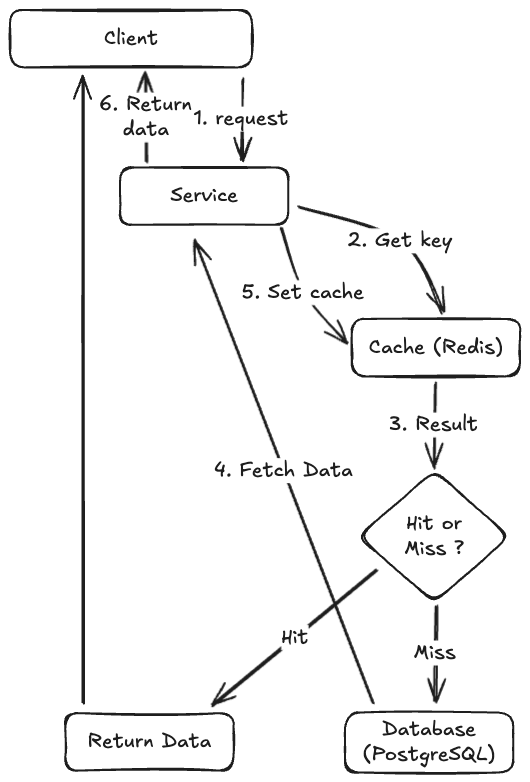

# Side Caching

Este documento descreve a estrategia de caching implementada no sistema NERBA Backoffice.

## Indice

- [Visao Geral](#visao-geral)
- [Arquitetura](#arquitetura)
- [Entidades com Cache](#entidades-com-cache)
- [Entidades sem Cache](#entidades-sem-cache)
- [Padroes de Chaves](#padroes-de-chaves)
- [Estrategia de Invalidacao](#estrategia-de-invalidacao)
- [Implementar Cache numa Nova Entidade](#implementar-cache-numa-nova-entidade)
- [Consideracoes de Performance](#consideracoes-de-performance)
- [Boas Praticas](#boas-praticas)
- [Referencias](#referencias)

---

## Visao Geral

O sistema utiliza o padrao **Cache-Aside** (Side Caching) com **Redis** como armazenamento distribuido. Este padrao permite reduzir a carga sobre a base de dados ao armazenar dados frequentemente acedidos em memoria.

### Caracteristicas

| Caracteristica | Descricao |
|----------------|-----------|
| Tecnologia | Redis via StackExchange.Redis |
| Padrao | Cache-Aside (Read-Through) |
| TTL Default | 60 minutos |
| Serializacao | JSON (System.Text.Json) |
| Escopo | Scoped (por request) |

### Fluxo de Operacao



---

## Arquitetura

### Componentes Principais

```
Shared/
├── Cache/
│   ├── ICacheKeyFabric.cs     # Interface para geracao de chaves
│   └── CacheKeyFabirc.cs      # Implementacao generica
└── Services/
    ├── ICacheService.cs       # Interface de operacoes Redis
    └── CacheService.cs        # Implementacao Redis

Core/[Entity]/Cache/
├── ICache[Entity]Repository.cs   # Interface especifica
└── Cache[Entity]Repository.cs    # Implementacao especifica
```

### ICacheService

Interface central que abstrai operacoes Redis.

| Metodo | Descricao |
|--------|-----------|
| `GetAsync<T>(key)` | Obtem valor deserializado do cache |
| `SetAsync<T>(key, value, expiry?)` | Armazena valor serializado no cache |
| `RemoveAsync(key)` | Remove entrada especifica |
| `RemovePatternAsync(pattern)` | Remove entradas por padrao (wildcard) |

### ICacheKeyFabric<T>

Interface generica para geracao consistente de chaves.

| Metodo | Exemplo de Saida |
|--------|------------------|
| `GenerateCacheKey(id)` | `Course:123` |
| `GenerateCacheKeyList()` | `Course:list` |
| `GenerateCacheKeyList(filter)` | `Course:list:active` |
| `GenerateCacheKeyManyToOne(id, Type)` | `Course:list:Frame:5` |
| `GenerateCacheKeyManyToOnePattern(Type)` | `Course:list:Frame:*` |

---

## Entidades com Cache

As seguintes entidades possuem implementacao de cache.

### Course

| Chave | Descricao | Operacoes |
|-------|-----------|-----------|
| `Course:{id}` | Curso individual | Get, Set, Remove |
| `Course:list` | Lista de todos os cursos | Get, Set, Remove |
| `Course:list:active` | Lista de cursos ativos | Get, Set, Remove |
| `Course:list:Frame:{id}` | Cursos por enquadramento | Get, Set, Remove |
| `Course:list:Module:{id}` | Cursos por modulo | Get, Set, Remove |

> Ver: `Core/Courses/Cache/CacheCourseRepository.cs`

### Module

| Chave | Descricao | Operacoes |
|-------|-----------|-----------|
| `Module:{id}` | Modulo individual | Get, Set, Remove |
| `Module:list` | Lista de todos os modulos | Get, Set, Remove |
| `Module:list:active` | Lista de modulos ativos | Get, Set, Remove |

> Ver: `Core/Modules/Cache/CacheModuleRepository.cs`

### CourseAction

| Chave | Descricao | Operacoes |
|-------|-----------|-----------|
| `CourseAction:{id}` | Acao individual | Get, Set, Remove |
| `CourseAction:list` | Lista de todas as acoes | Get, Set, Remove |
| `CourseAction:list:Course:{id}` | Acoes por curso | Get, Set, Remove |
| `CourseAction:list:Module:{id}` | Acoes por modulo | Get, Set, Remove |

> Ver: `Core/Actions/Cache/CacheActionRepository.cs`

### Person

| Chave | Descricao | Operacoes |
|-------|-----------|-----------|
| `Person:{id}` | Pessoa individual | Get, Set, Remove |
| `Person:list` | Lista de todas as pessoas | Get, Set, Remove |
| `Person:list:without:{profile}` | Pessoas sem perfil especifico | Get, Set, Remove |

> Ver: `Core/People/Cache/CachePeopleRepository.cs`

### Teacher

| Chave | Descricao | Operacoes |
|-------|-----------|-----------|
| `Teacher:{id}` | Formador individual | Get, Set, Remove |
| `Teacher:list` | Lista de todos os formadores | Get, Set, Remove |

> Ver: `Core/Teachers/Cache/CacheTeacherRepository.cs`

### Student

| Chave | Descricao | Operacoes |
|-------|-----------|-----------|
| `Student:{id}` | Formando individual | Get, Set, Remove |
| `Student:list` | Lista de todos os formandos | Get, Set, Remove |
| `Student:list:Company:{id}` | Formandos por empresa | Get, Set, Remove |

> Ver: `Core/Students/Cache/CacheStudentsRepository.cs`

---

## Entidades sem Cache

As seguintes entidades nao possuem implementacao de cache atualmente.

| Entidade | Razao |
|----------|-------|
| Company | Volume baixo de acessos |
| Frame | Dados estaticos, raramente alterados |
| Session | Dados frequentemente alterados |
| SessionParticipation | Relacionamento transacional |
| ActionEnrollment | Relacionamento transacional |
| ModuleTeaching | Relacionamento transacional |
| ModuleAvaliation | Dados de avaliacao |
| Payment | Dados financeiros sensiveis |
| Notification | Dados volateis |
| Account/User | Seguranca (autenticacao/autorizacao) |
| Kpi | Dados calculados dinamicamente |

---

## Padroes de Chaves

O sistema segue convencoes consistentes para chaves de cache.

### Formato Base

```
{EntityName}:{identifier}
```

### Convencoes

| Padrao | Formato | Exemplo |
|--------|---------|---------|
| Entidade singular | `Entity:{id}` | `Course:123` |
| Lista completa | `Entity:list` | `Course:list` |
| Lista filtrada | `Entity:list:{filter}` | `Course:list:active` |
| Relacao N:1 | `Entity:list:{RelatedEntity}:{id}` | `Course:list:Frame:5` |
| Wildcard | `Entity:list:{RelatedEntity}:*` | `Course:list:Frame:*` |

### Nomenclatura

- Usar **PascalCase** para nomes de entidades
- Usar **camelCase** para filtros
- Separador: `:` (dois pontos)
- Wildcard: `*` (asterisco)

---

## Estrategia de Invalidacao

A invalidacao de cache segue o principio de **invalidar agressivamente** para garantir consistencia de dados.

### Regras de Invalidacao

1. **Ao criar**: Invalidar listas relacionadas, definir entrada individual
2. **Ao atualizar**: Invalidar entrada individual e todas as listas relacionadas
3. **Ao eliminar**: Invalidar entrada individual e todas as listas relacionadas

### Exemplo de Invalidacao (Course)

```csharp
public async Task RemoveCourseCacheAsync(long? id = null)
{
    if (id is not null)
    {
        // Remove entrada individual
        await _cacheService.RemoveAsync(_cacheKeyFabric.GenerateCacheKey($"{id}"));

        // Remove listas gerais
        await _cacheService.RemoveAsync(_cacheKeyFabric.GenerateCacheKeyList());
        await _cacheService.RemoveAsync(_cacheKeyFabric.GenerateCacheKeyList("active"));

        // Remove listas de relacoes (wildcard)
        await _cacheService.RemovePatternAsync(
            _cacheKeyFabric.GenerateCacheKeyManyToOnePattern(typeof(Frame)));
        await _cacheService.RemovePatternAsync(
            _cacheKeyFabric.GenerateCacheKeyManyToOnePattern(typeof(Module)));
    }
    else
    {
        // Remove tudo relacionado a cursos
        await _cacheService.RemovePatternAsync($"{typeof(Course).Name}:*");
    }
}
```

### Invalidacao em Cascata

Quando uma entidade e alterada, deve-se invalidar caches de entidades dependentes.

```csharp
// Exemplo em PeopleService
private async Task RemoveRelatedCache(long? id = null)
{
    await _cache.RemovePeopleCacheAsync(id);
    await _cacheStudents.RemoveStudentsCacheAsync();  // Invalidar formandos
    await _cacheTeacher.RemoveTeacherCacheAsync();    // Invalidar formadores
}
```

---

## Implementar Cache numa Nova Entidade

Para adicionar caching a uma nova entidade, seguir estes passos.

### 1. Criar Interface do Repositorio Cache

```csharp
// Core/[Entity]/Cache/ICache[Entity]Repository.cs
public interface ICacheCompanyRepository
{
    Task RemoveCompanyCacheAsync(long? id = null);
    Task SetSingleCompanyCacheAsync(RetrieveCompanyDto company);
    Task<RetrieveCompanyDto?> GetSingleCompanyCacheAsync(long id);
    Task<IEnumerable<RetrieveCompanyDto>?> GetCacheAllCompaniesAsync();
    Task SetAllCompaniesCacheAsync(IEnumerable<RetrieveCompanyDto> companies);
}
```

### 2. Implementar Repositorio Cache

```csharp
// Core/[Entity]/Cache/Cache[Entity]Repository.cs
public class CacheCompanyRepository(
    ICacheKeyFabric<Company> cacheKeyFabric,
    ICacheService cacheService
) : ICacheCompanyRepository
{
    private readonly ICacheKeyFabric<Company> _cacheKeyFabric = cacheKeyFabric;
    private readonly ICacheService _cacheService = cacheService;

    public async Task<IEnumerable<RetrieveCompanyDto>?> GetCacheAllCompaniesAsync()
    {
        return await _cacheService.GetAsync<IEnumerable<RetrieveCompanyDto>>(
            _cacheKeyFabric.GenerateCacheKeyList());
    }

    public async Task<RetrieveCompanyDto?> GetSingleCompanyCacheAsync(long id)
    {
        return await _cacheService.GetAsync<RetrieveCompanyDto>(
            _cacheKeyFabric.GenerateCacheKey(id.ToString()));
    }

    public async Task RemoveCompanyCacheAsync(long? id = null)
    {
        if (id is not null)
        {
            await _cacheService.RemoveAsync(_cacheKeyFabric.GenerateCacheKey($"{id}"));
            await _cacheService.RemoveAsync(_cacheKeyFabric.GenerateCacheKeyList());
        }
        else
        {
            await _cacheService.RemovePatternAsync($"{typeof(Company).Name}:*");
        }
    }

    public async Task SetAllCompaniesCacheAsync(IEnumerable<RetrieveCompanyDto> companies)
    {
        await _cacheService.SetAsync(_cacheKeyFabric.GenerateCacheKeyList(), companies);
    }

    public async Task SetSingleCompanyCacheAsync(RetrieveCompanyDto company)
    {
        await _cacheService.SetAsync(
            _cacheKeyFabric.GenerateCacheKey(company.Id.ToString()), company);
    }
}
```

### 3. Registar no Container DI

```csharp
// Program.cs
builder.Services.AddScoped<ICacheKeyFabric<Company>, CacheKeyFabirc<Company>>();
builder.Services.AddScoped<ICacheCompanyRepository, CacheCompanyRepository>();
```

### 4. Injetar no Service

```csharp
public class CompanyService(
    AppDbContext context,
    ILogger<CompanyService> logger,
    ICacheCompanyRepository cache
) : ICompanyService
{
    // ...
}
```

### 5. Implementar Padrao Cache-Aside no Service

```csharp
public async Task<Result<RetrieveCompanyDto>> GetByIdAsync(long id)
{
    // 1. Tentar obter do cache
    var cachedCompany = await _cache.GetSingleCompanyCacheAsync(id);
    if (cachedCompany is not null)
        return Result<RetrieveCompanyDto>.Ok(cachedCompany);

    // 2. Obter da base de dados
    var company = await _context.Companies.FindAsync(id);
    if (company is null)
        return Result<RetrieveCompanyDto>
            .Fail("Nao encontrado.", "Empresa nao encontrada.",
            StatusCodes.Status404NotFound);

    var retrieveCompany = Company.ConvertEntityToRetrieveDto(company);

    // 3. Armazenar no cache
    await _cache.SetSingleCompanyCacheAsync(retrieveCompany);

    return Result<RetrieveCompanyDto>.Ok(retrieveCompany);
}

public async Task<Result<RetrieveCompanyDto>> UpdateAsync(UpdateCompanyDto dto)
{
    // ... logica de atualizacao ...

    // Invalidar cache apos alteracao
    await _cache.RemoveCompanyCacheAsync(dto.Id);
    await _cache.SetSingleCompanyCacheAsync(retrieveCompany);

    return Result<RetrieveCompanyDto>.Ok(retrieveCompany, "Empresa Atualizada");
}
```

### Estrutura de Ficheiros Final

```
Core/Companies/
├── Cache/
│   ├── ICacheCompanyRepository.cs
│   └── CacheCompanyRepository.cs
├── Controllers/
│   └── CompanyController.cs
├── Dtos/
│   └── ...
├── Models/
│   └── Company.cs
└── Services/
    ├── ICompanyService.cs
    └── CompanyService.cs
```

---

## Consideracoes de Performance

### TTL (Time-To-Live)

| Tipo de Dados | TTL Recomendado |
|---------------|-----------------|
| Listas gerais | 60 minutos (default) |
| Entidades individuais | 60 minutos |
| Dados estaticos | 120+ minutos |
| Dados volateis | 15-30 minutos |

### Customizar TTL

```csharp
// Definir TTL personalizado
await _cacheService.SetAsync(key, value, TimeSpan.FromMinutes(30));
```

### Monitorizacao

Utilizar **RedisInsight** para monitorizar:
- Taxa de hits/misses
- Memoria utilizada
- Chaves em cache
- TTLs restantes

---

## Boas Praticas

### Consistencia

1. **Sempre invalidar antes de definir** - Evita dados obsoletos
2. **Invalidar em cascata** - Considerar entidades dependentes
3. **Usar wildcards com cuidado** - Podem afetar performance

### Nomenclatura

1. **Chaves descritivas** - Facilita debugging
2. **Padroes consistentes** - Seguir convencoes do projeto
3. **Evitar chaves longas** - Impacta memoria e rede

### Seguranca

1. **Nao fazer cache de dados sensiveis** - Passwords, tokens
2. **Dados financeiros** - Evitar ou usar TTL curto
3. **Dados de autenticacao** - Preferir mecanismos especificos

### Quando NAO Usar Cache

- Dados que mudam frequentemente
- Dados transacionais criticos
- Dados que requerem consistencia forte
- Queries complexas ou dinamicas

---

## Referencias

### Codigo Fonte

| Componente | Localizacao |
|------------|-------------|
| ICacheService | `Shared/Services/ICacheService.cs` |
| CacheService | `Shared/Services/CacheService.cs` |
| ICacheKeyFabric | `Shared/Cache/ICacheKeyFabric.cs` |
| CacheKeyFabirc | `Shared/Cache/CacheKeyFabirc.cs` |
| Cache Repositories | `Core/[Entity]/Cache/` |

### Configuracao Redis

| Ficheiro | Descricao |
|----------|-----------|
| `.env` | Connection string Redis |
| `Program.cs` | Registo de servicos |
| `docker-compose.yml` | Container Redis |

### Documentacao Externa

> Ref: [Redis Documentation](https://redis.io/docs/)

> Ref: [StackExchange.Redis](https://stackexchange.github.io/StackExchange.Redis/)

> Ref: [Cache-Aside Pattern (Microsoft)](https://learn.microsoft.com/en-us/azure/architecture/patterns/cache-aside)

### Documentacao Relacionada

> Ver: [Logica de Negocio](./LOGICA_DE_NEGOCIO.md)

> Ver: [Validacoes de Entidades](./VALIDACOES.md)
