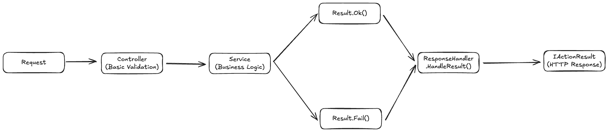

# Padrao Result e Response Handler

Este documento descreve o padrao Result implementado no sistema NERBA Backoffice para gestao de respostas entre services e controllers.

## Indice

- [Visao Geral](#visao-geral)
- [Arquitetura](#arquitetura)
- [Classes Result](#classes-result)
- [Response Handler](#response-handler)
- [Fluxo de Dados](#fluxo-de-dados)
- [Mapeamento de Status Codes](#mapeamento-de-status-codes)
- [Exemplos Praticos](#exemplos-praticos)
- [Implementar numa Nova Funcionalidade](#implementar-numa-nova-funcionalidade)
- [Boas Praticas](#boas-praticas)
- [Referencias](#referencias)

---

## Visao Geral

O padrao Result encapsula o resultado de operacoes de negocio, separando a logica de dominio da transformacao para respostas HTTP. Este padrao oferece:

| Beneficio | Descricao |
|-----------|-----------|
| Separacao de responsabilidades | Services retornam resultados de negocio, controllers transformam em HTTP |
| Consistencia | Formato uniforme de respostas em toda a API |
| Tipagem forte | Erros e sucessos sao tipados, evitando excepcoes para fluxos esperados |
| Testabilidade | Services podem ser testados independentemente do contexto HTTP |

### Principio Fundamental

```
Services NAO devem conhecer IActionResult
Controllers NAO devem conter logica de negocio
```

---

## Arquitetura

### Componentes Principais

```
Shared/
├── Models/
│   ├── Result.cs         # Classes Result e Result<T>
│   └── OkMessage.cs      # Wrapper para respostas de sucesso
└── Services/
    ├── IResponseHandler.cs   # Interface de transformacao
    └── ResponseHandler.cs    # Implementacao
```

### Diagrama de Fluxo



---

## Classes Result

### Result (Base)

Classe nao-generica para operacoes sem dados de retorno.

```csharp
public class Result
{
    public bool Success { get; set; }
    public string? Title { get; set; }
    public string? Message { get; set; }
    public int? StatusCode { get; set; }
    public object? Errors { get; set; }
}
```

#### Metodos Estaticos

| Metodo | Descricao |
|--------|-----------|
| `Ok(title, message, status?)` | Cria resultado de sucesso (2xx) |
| `Fail(title, message, statusCode?)` | Cria resultado de falha |
| `Fail(title, message, errors, statusCode?)` | Cria resultado de falha com detalhes |

#### Exemplos de Uso

```csharp
// Sucesso simples
return Result.Ok("Pessoa Eliminada.", "Pessoa eliminada com sucesso.");

// Sucesso com status customizado
return Result.Ok("Recurso Criado.", "Operacao concluida.", StatusCodes.Status201Created);

// Falha com status default (400)
return Result.Fail("Erro de Validacao.", "O NIF deve ser unico.");

// Falha com status especifico
return Result.Fail("Nao encontrado.", "Pessoa nao encontrada.", StatusCodes.Status404NotFound);
```

### Result&lt;T&gt; (Generica)

Classe generica que herda de Result, adicionando payload de dados.

```csharp
public class Result<T> : Result
{
    public T? Data { get; set; }
}
```

#### Metodos Estaticos

| Metodo | Descricao |
|--------|-----------|
| `Ok(data)` | Cria resultado com dados apenas |
| `Ok(data, title, message)` | Cria resultado com dados e mensagens |
| `Ok(data, title, message, status)` | Cria resultado completo |
| `Fail(title, message, statusCode?)` | Cria resultado de falha |
| `Fail(title, message, errors, statusCode?)` | Cria resultado de falha com detalhes |

#### Exemplos de Uso

```csharp
// Sucesso apenas com dados (status 200)
return Result<IEnumerable<RetrievePersonDto>>.Ok(people);

// Sucesso com dados e mensagens
return Result<RetrievePersonDto>.Ok(
    person,
    "Pessoa Atualizada.",
    $"Foi atualizada a pessoa com o nome {person.FullName}.");

// Sucesso com criacao (status 201)
return Result<RetrievePersonDto>.Ok(
    createdPerson,
    "Pessoa Criada.",
    "A pessoa foi registada no sistema.",
    StatusCodes.Status201Created);

// Falha de validacao
return Result<RetrievePersonDto>.Fail(
    "Erro de Validacao.",
    "O NIF da pessoa deve ser unico. Ja existe no sistema.");

// Falha com status especifico
return Result<RetrievePersonDto>.Fail(
    "Nao encontrado.",
    "Pessoa nao encontrada.",
    StatusCodes.Status404NotFound);
```

---

## Response Handler

O `ResponseHandler` transforma objetos `Result` em `IActionResult` para resposta HTTP.

### Interface

```csharp
public interface IResponseHandler
{
    IActionResult HandleResult<T>(Result<T> result);
    IActionResult HandleResult(Result result);
}
```

### Logica de Transformacao

#### Para Resultados de Falha

Retorna `ProblemDetails` (RFC 7807) com o status code apropriado:

```csharp
var problemDetails = new ProblemDetails
{
    Title = result.Title,
    Detail = result.Message,
    Status = result.StatusCode,
};

if (result.Errors is not null)
{
    problemDetails.Extensions["errors"] = result.Errors;
}

return new ObjectResult(problemDetails)
{
    StatusCode = result.StatusCode ?? StatusCodes.Status400BadRequest
};
```

#### Para Resultados de Sucesso com Mensagens

Retorna `OkMessage<T>` envolvendo os dados:

```csharp
var okResult = new OkMessage<T>(
    result.Title,
    result.Message,
    result.Data,
    result.StatusCode
);

return new ObjectResult(okResult)
{
    StatusCode = result.StatusCode ?? StatusCodes.Status200OK
};
```

#### Para Resultados de Sucesso sem Mensagens

Retorna apenas os dados:

```csharp
return new ObjectResult(result.Data)
{
    StatusCode = result.StatusCode ?? StatusCodes.Status200OK
};
```

### Modelo OkMessage

```csharp
public class OkMessage<T>
{
    public int? StatusCode { get; set; }
    public string Title { get; set; }
    public string Message { get; set; }
    public T? Data { get; set; }
}
```

---

## Fluxo de Dados

### Cenario: Criar Pessoa

```
1. Controller recebe CreatePersonDto
        │
        ▼
2. Service valida dados
        │
        ├── NIF duplicado? ──► Result<T>.Fail("Erro de Validacao.", ...)
        │
        ├── Enum invalido? ──► Result<T>.Fail("Nao encontrado.", ..., 404)
        │
        ▼
3. Service persiste entidade
        │
        ▼
4. Service retorna Result<T>.Ok(pessoa, "Pessoa Criada.", ..., 201)
        │
        ▼
5. Controller chama _responseHandler.HandleResult(result)
        │
        ▼
6. ResponseHandler transforma em IActionResult
        │
        ├── Se Fail ──► ProblemDetails com status code
        │
        └── Se Ok ──► OkMessage<T> ou dados raw
```

### Cenario: Eliminar Pessoa

```
1. Controller recebe id
        │
        ▼
2. Service verifica existencia
        │
        ├── Nao existe? ──► Result.Fail("Nao encontrado.", ..., 404)
        │
        ├── E utilizador? ──► Result.Fail("Erro de Validacao.", ...)
        │
        ▼
3. Service remove entidade
        │
        ▼
4. Service retorna Result.Ok("Pessoa Eliminada.", ...)
        │
        ▼
5. Controller chama _responseHandler.HandleResult(result)
        │
        ▼
6. ResponseHandler retorna { Title, Message } com status 200
```

---

## Mapeamento de Status Codes

### Status Codes Comuns

| Cenario | Status Code | Metodo Result |
|---------|-------------|---------------|
| Sucesso generico | 200 OK | `Result.Ok()` ou `Result<T>.Ok(data)` |
| Recurso criado | 201 Created | `Result<T>.Ok(data, ..., 201)` |
| Erro de validacao | 400 Bad Request | `Result.Fail()` (default) |
| Nao autorizado | 401 Unauthorized | `Result.Fail(..., 401)` |
| Nao encontrado | 404 Not Found | `Result.Fail(..., 404)` |
| Erro interno | 500 Internal Server Error | `Result.Fail(..., 500)` |

### Convencoes do Projeto

| Tipo de Erro | Title | Status |
|--------------|-------|--------|
| Validacao de unicidade | "Erro de Validacao." | 400 |
| Entidade nao encontrada | "Nao encontrado." | 404 |
| Enum invalido | "Nao encontrado." | 404 |
| Restricao de negocio | "Erro de Validacao." | 400 |
| Falha de ficheiro | "Erro interno." | 500 |

---

## Exemplos Praticos

### Service: Operacao de Leitura

```csharp
public async Task<Result<RetrievePersonDto>> GetByIdAsync(long id)
{
    // Verificar cache
    var cachedPerson = await _cache.GetSinglePersonCacheAsync(id);
    if (cachedPerson is not null)
        return Result<RetrievePersonDto>.Ok(cachedPerson);

    // Buscar na base de dados
    var existingPerson = await _context.People
        .AsNoTracking()
        .FirstOrDefaultAsync(p => p.Id == id);

    if (existingPerson is null)
        return Result<RetrievePersonDto>
            .Fail("Nao encontrado.", "Pessoa nao encontrada.",
            StatusCodes.Status404NotFound);

    var retrievePerson = Person.ConvertEntityToRetrieveDto(existingPerson);

    // Atualizar cache
    await _cache.SetSinglePersonCacheAsync(retrievePerson);

    return Result<RetrievePersonDto>.Ok(retrievePerson);
}
```

### Service: Operacao de Criacao

```csharp
public async Task<Result<RetrieveSessionDto>> CreateAsync(CreateSessionDto entityDto)
{
    // Validar relacoes
    var moduleTeaching = await _context.ModuleTeachings.FindAsync(entityDto.ModuleTeachingId);
    if (moduleTeaching is null)
        return Result<RetrieveSessionDto>
            .Fail("Nao encontrado.", "Relacao entre Formador e Modulo nao encontrada.",
            StatusCodes.Status404NotFound);

    // Validar regras de negocio
    if (!action.IsActionActive)
        return Result<RetrieveSessionDto>
            .Fail("Erro de Validacao.",
            "Nao e possivel criar sessao quando a acao esta inativa.");

    // Validar enums
    if (!EnumHelp.IsValidEnum<WeekDaysEnum>(entityDto.Weekday))
        return Result<RetrieveSessionDto>
            .Fail("Erro de Validacao.", "O dia da semana inserido nao e valido.");

    // Criar entidade
    var createdEntity = _context.Sessions.Add(Session.ConvertCreateDtoToEntity(entityDto));
    await _context.SaveChangesAsync();

    var retrieveSession = Session.ConvertEntityToRetrieveDto(createdEntity.Entity);

    return Result<RetrieveSessionDto>
        .Ok(retrieveSession, "Sessao criada.", "A sessao foi agendada com sucesso.");
}
```

### Service: Operacao de Eliminacao

```csharp
public async Task<Result> DeleteAsync(long id)
{
    var existingSession = await _context.Sessions.FindAsync(id);
    if (existingSession is null)
        return Result
            .Fail("Nao encontrado.", "Sessao nao encontrada.",
            StatusCodes.Status404NotFound);

    // Validar restricoes
    if (existingSession.TeacherPresence.Equals(PresenceEnum.Present))
        return Result
            .Fail("Erro de Validacao.", "A sessao ja foi lecionada, nao e possivel eliminar.");

    _context.Sessions.Remove(existingSession);
    await _context.SaveChangesAsync();

    return Result.Ok("Sessao eliminada.", "Sessao eliminada com sucesso.");
}
```

### Controller: Utilizacao Padrao

```csharp
[HttpGet("{id:long}")]
[Authorize(Policy = "ActiveUser")]
public async Task<IActionResult> GetPersonAsync(long id)
{
    Result<RetrievePersonDto> result = await _peopleService.GetByIdAsync(id);
    return _responseHandler.HandleResult(result);
}

[HttpPost("create")]
[Authorize(Policy = "ActiveUser")]
public async Task<IActionResult> CreatePersonAsync([FromBody] CreatePersonDto person)
{
    Result<RetrievePersonDto> result = await _peopleService.CreateAsync(person);
    return _responseHandler.HandleResult(result);
}

[HttpDelete("delete/{id:long}")]
[Authorize(Policy = "ActiveUser")]
public async Task<IActionResult> DeletePersonAsync(long id)
{
    Result result = await _peopleService.DeleteAsync(id);
    return _responseHandler.HandleResult(result);
}
```

### Controller: Caso Especial (Download de Ficheiros)

Quando o resultado e um ficheiro, o controller processa manualmente:

```csharp
[HttpGet("{id:long}/habilitation-pdf")]
[Authorize(Policy = "ActiveUser")]
public async Task<IActionResult> DownloadHabilitationPdfAsync(long id)
{
    var result = await _peopleService.GetHabilitationPdfAsync(id);

    // Usar handler para erros
    if (!result.Success)
        return _responseHandler.HandleResult(result);

    // Retornar ficheiro para sucesso
    var fileResult = result.Data!;
    return File(fileResult.Content, "application/pdf", fileResult.FileName);
}
```

---

## Implementar numa Nova Funcionalidade

### 1. Definir Interface do Service

```csharp
public interface ICompanyService
{
    Task<Result<IEnumerable<RetrieveCompanyDto>>> GetAllAsync();
    Task<Result<RetrieveCompanyDto>> GetByIdAsync(long id);
    Task<Result<RetrieveCompanyDto>> CreateAsync(CreateCompanyDto entityDto);
    Task<Result<RetrieveCompanyDto>> UpdateAsync(UpdateCompanyDto entityDto);
    Task<Result> DeleteAsync(long id);
}
```

### 2. Implementar Service

```csharp
public class CompanyService : ICompanyService
{
    private readonly AppDbContext _context;
    private readonly ILogger<CompanyService> _logger;

    public CompanyService(AppDbContext context, ILogger<CompanyService> logger)
    {
        _context = context;
        _logger = logger;
    }

    public async Task<Result<RetrieveCompanyDto>> CreateAsync(CreateCompanyDto entityDto)
    {
        // Validacao de unicidade
        if (await _context.Companies.AnyAsync(c => c.NIF == entityDto.NIF))
        {
            _logger.LogWarning("Duplicated NIF detected: {NIF}", entityDto.NIF);
            return Result<RetrieveCompanyDto>
                .Fail("Erro de Validacao.", "O NIF da empresa deve ser unico.");
        }

        // Criacao
        var entity = Company.ConvertCreateDtoToEntity(entityDto);
        var created = _context.Companies.Add(entity);
        await _context.SaveChangesAsync();

        var retrieveDto = Company.ConvertEntityToRetrieveDto(created.Entity);

        return Result<RetrieveCompanyDto>
            .Ok(retrieveDto, "Empresa Criada.",
                $"Foi criada a empresa {retrieveDto.Name}.",
                StatusCodes.Status201Created);
    }

    // ... outros metodos
}
```

### 3. Implementar Controller

```csharp
[Route("api/[controller]")]
[ApiController]
public class CompaniesController : ControllerBase
{
    private readonly ICompanyService _companyService;
    private readonly IResponseHandler _responseHandler;

    public CompaniesController(
        ICompanyService companyService,
        IResponseHandler responseHandler)
    {
        _companyService = companyService;
        _responseHandler = responseHandler;
    }

    [HttpPost("create")]
    [Authorize(Policy = "ActiveUser")]
    public async Task<IActionResult> CreateCompanyAsync([FromBody] CreateCompanyDto company)
    {
        Result<RetrieveCompanyDto> result = await _companyService.CreateAsync(company);
        return _responseHandler.HandleResult(result);
    }
}
```

### 4. Registar no Container DI

```csharp
// Program.cs
builder.Services.AddScoped<ICompanyService, CompanyService>();
```

---

## Boas Praticas

### Services

1. **Validar cedo** - Retornar `Fail` assim que uma condicao invalida e detectada
2. **Mensagens em portugues** - Usar mensagens claras para o utilizador final
3. **Logging antes de Fail** - Registar detalhes tecnicos antes de retornar erros
4. **Status codes apropriados** - Usar 404 para "nao encontrado", 400 para validacao

### Controllers

1. **Delegar ao service** - Nunca conter logica de negocio
2. **Usar ResponseHandler** - Sempre transformar Result com o handler
3. **Casos especiais** - Tratar downloads e streams manualmente
4. **Documentar endpoints** - Usar XML comments para Swagger

### Mensagens de Erro

| Tipo | Title | Exemplo Message |
|------|-------|-----------------|
| Entidade nao existe | "Nao encontrado." | "Pessoa nao encontrada." |
| Duplicado | "Erro de Validacao." | "O NIF ja existe no sistema." |
| Restricao de negocio | "Erro de Validacao." | "Nao pode eliminar uma pessoa que e utilizador." |
| Enum invalido | "Nao encontrado." | "Genero nao encontrado." |

### Evitar

- Lancar excepcoes para fluxos esperados (usar `Result.Fail`)
- Retornar `IActionResult` diretamente do service
- Misturar logica de negocio no controller
- Usar status codes inconsistentes para o mesmo tipo de erro

---

## Referencias

### Codigo Fonte

| Componente | Localizacao |
|------------|-------------|
| Result.cs | `Shared/Models/Result.cs` |
| OkMessage.cs | `Shared/Models/OkMessage.cs` |
| IResponseHandler | `Shared/Services/IResponseHandler.cs` |
| ResponseHandler | `Shared/Services/ResponseHandler.cs` |

### Exemplos no Projeto

| Entidade | Service | Controller |
|----------|---------|------------|
| People | `Core/People/Services/PeopleService.cs` | `Core/People/Controllers/PeopleController.cs` |
| Sessions | `Core/Sessions/Services/SessionService.cs` | `Core/Sessions/Controllers/SessionsController.cs` |
| Notifications | `Core/Notifications/Services/NotificationService.cs` | `Core/Notifications/Controllers/NotificationController.cs` |
| Auth | `Core/Authentication/Services/JwtService.cs` | `Core/Authentication/Controllers/AuthController.cs` |

### Documentacao Relacionada

> Ver: [Validacoes de Entidades](./VALIDACOES.md)

> Ver: [Logica de Negocio](./LOGICA_DE_NEGOCIO.md)

> Ver: [Side Caching](./CACHING.md)

### Referencias Externas

> Ref: [RFC 7807 - Problem Details](https://datatracker.ietf.org/doc/html/rfc7807)

> Ref: [Result Pattern (Microsoft)](https://learn.microsoft.com/en-us/dotnet/architecture/microservices/microservice-ddd-cqrs-patterns/implement-value-objects)
