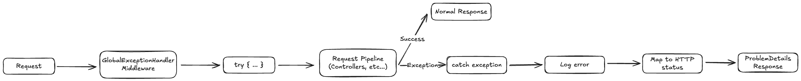

# Tratamento Global de Erros

Este documento descreve a estrategia de tratamento global de erros implementada no sistema NERBA Backoffice.

## Indice

- [Visao Geral](#visao-geral)
- [Arquitetura](#arquitetura)
- [Middleware de Excecoes](#middleware-de-excecoes)
- [Tipos de Excecao Personalizados](#tipos-de-excecao-personalizados)
- [Mapeamento de Excecoes para HTTP](#mapeamento-de-excecoes-para-http)
- [Formato de Resposta de Erro](#formato-de-resposta-de-erro)
- [Integracao com Logging](#integracao-com-logging)
- [Padrao Result](#padrao-result)
- [Adicionar Novas Excecoes](#adicionar-novas-excecoes)
- [Cenarios de Erro Comuns](#cenarios-de-erro-comuns)
- [Boas Praticas](#boas-praticas)
- [Referencias](#referencias)

---

## Visao Geral

O sistema utiliza uma abordagem centralizada para tratamento de erros atraves de middleware ASP.NET Core. Esta estrategia garante respostas consistentes e padronizadas para todos os erros da aplicacao.

### Caracteristicas

| Caracteristica | Descricao |
|----------------|-----------|
| Abordagem | Middleware centralizado |
| Formato resposta | ProblemDetails (RFC 7807) |
| Serializacao | JSON (camelCase) |
| Logging | ILogger integrado |
| Ambiente | Comportamento diferenciado Dev/Prod |

### Fluxo de Tratamento de Erros



---

## Arquitetura

### Componentes Principais

```
Shared/
├── Middleware/
│   ├── GlobalExceptionHandlerMiddleware.cs   # Tratamento central de excecoes
│   └── TokenBlacklistMiddleware.cs           # Validacao de tokens
├── Exceptions/
│   ├── ObjectNullException.cs                # Recurso nao encontrado
│   └── ValidationException.cs                # Erro de validacao
├── Models/
│   └── Result.cs                             # Padrao Result para respostas
└── Services/
    ├── IResponseHandler.cs                   # Interface de resposta
    └── ResponseHandler.cs                    # Conversao Result -> IActionResult
```

### Ordem de Middleware

A ordem de registo no pipeline e critica para o correto funcionamento.

```csharp
// Program.cs - Ordem de middleware
app.UseAuthentication();
app.UseAuthorization();
app.UseMiddleware<TokenBlacklistMiddleware>();  // Verificacao de tokens
app.UseMiddleware<GlobalExceptionHandlerMiddleware>();  // Tratamento de erros
app.MapControllers();
```

> Ver: `NERBABO.Backend/NERBABO.ApiService/Program.cs` (linhas 489-496)

---

## Middleware de Excecoes

### GlobalExceptionHandlerMiddleware

O middleware central implementa `IMiddleware` e encapsula todo o pipeline de request num bloco try-catch.

```csharp
public class GlobalExceptionHandlerMiddleware : IMiddleware
{
    private readonly ILogger<GlobalExceptionHandlerMiddleware> _logger;
    private readonly JsonSerializerOptions _serializer;

    public async Task InvokeAsync(HttpContext context, RequestDelegate next)
    {
        try
        {
            await next(context);
        }
        catch (Exception exception)
        {
            await HandleExceptionAsync(context, exception);
        }
    }
}
```

### Registo no Container DI

```csharp
// Program.cs
builder.Services.AddTransient<GlobalExceptionHandlerMiddleware>();
```

> Ver: `Shared/Middleware/GlobalExceptionHandlerMiddleware.cs`

---

## Tipos de Excecao Personalizados

O sistema define excecoes personalizadas para cenarios especificos de dominio.

### ObjectNullException

Utilizada quando um recurso solicitado nao existe.

```csharp
public class ObjectNullException : Exception
{
    public ObjectNullException(string message) : base(message) { }
    public ObjectNullException(string message, Exception innerException)
        : base(message, innerException) { }
}
```

**Utilizacao:**

```csharp
var action = await _context.Actions.FindAsync(actionId)
    ?? throw new ObjectNullException("Acao nao encontrada.");
```

> Ver: `Shared/Exceptions/ObjectNullException.cs`

### ValidationException

Utilizada para erros de validacao de regras de negocio.

```csharp
public class ValidationException : Exception
{
    public ValidationException(string message) : base(message) { }
    public ValidationException(string message, Exception innerException)
        : base(message, innerException) { }
}
```

> Ver: `Shared/Exceptions/ValidationException.cs`

---

## Mapeamento de Excecoes para HTTP

O middleware mapeia tipos de excecao para codigos HTTP apropriados.

| Tipo de Excecao | HTTP Status | Titulo |
|-----------------|-------------|--------|
| `KeyNotFoundException` | 404 Not Found | Recurso nao encontrado |
| `ObjectNullException` | 404 Not Found | Recurso nao encontrado |
| `InvalidOperationException` | 400 Bad Request | Operacao invalida |
| `ArgumentNullException` | 400 Bad Request | Parametros invalidos |
| `ArgumentException` | 400 Bad Request | Parametros invalidos |
| `UnauthorizedAccessException` | 401 Unauthorized | Acesso nao autorizado |
| `ValidationException` | 400 Bad Request | Erro de validacao |
| `Exception` (default) | 500 Internal Server Error | Erro interno do servidor |

### Implementacao do Mapeamento

```csharp
switch (exception)
{
    case KeyNotFoundException or ObjectNullException:
        response.StatusCode = StatusCodes.Status404NotFound;
        problemDetails.Title = "Recurso nao encontrado.";
        break;

    case InvalidOperationException:
        response.StatusCode = StatusCodes.Status400BadRequest;
        problemDetails.Title = "Operacao invalida.";
        break;

    case ArgumentNullException or ArgumentException:
        response.StatusCode = StatusCodes.Status400BadRequest;
        problemDetails.Title = "Parametros invalidos.";
        break;

    case UnauthorizedAccessException:
        response.StatusCode = StatusCodes.Status401Unauthorized;
        problemDetails.Title = "Acesso nao autorizado.";
        break;

    case ValidationException validationEx:
        response.StatusCode = StatusCodes.Status400BadRequest;
        problemDetails.Title = "Erro de validacao.";
        break;

    default:
        response.StatusCode = StatusCodes.Status500InternalServerError;
        problemDetails.Title = "Erro interno do servidor.";
        break;
}
```

---

## Formato de Resposta de Erro

Todas as respostas de erro seguem o formato **ProblemDetails** (RFC 7807).

### Estrutura Base

```json
{
  "title": "Recurso nao encontrado.",
  "detail": "Acao nao encontrada.",
  "status": 404
}
```

### Resposta em Ambiente de Desenvolvimento

Em modo Development, informacoes adicionais de debug sao incluidas.

```json
{
  "title": "Erro interno do servidor.",
  "detail": "Object reference not set to an instance of an object.",
  "status": 500,
  "stackTrace": "at NERBABO.ApiService.Core..."
}
```

### Implementacao Condicional

```csharp
if (Environment.GetEnvironmentVariable("ASPNETCORE_ENVIRONMENT") == "Development")
{
    problemDetails.Detail = exception.Message;
    problemDetails.Extensions["StackTrace"] = exception.StackTrace;
}
```

### Validacao de Model State

Erros de validacao de modelo (Data Annotations) retornam um formato ligeiramente diferente.

```json
{
  "title": "Erro de Validacao",
  "status": 400,
  "errors": [
    "O campo NIF e obrigatorio.",
    "O email deve ser valido."
  ]
}
```

> Ver: `Program.cs` (linhas 319-343) - `ApiBehaviorOptions`

---

## Integracao com Logging

O middleware utiliza `ILogger` para registar todas as excecoes.

### Niveis de Log por Tipo

| Tipo de Excecao | Nivel de Log |
|-----------------|--------------|
| `KeyNotFoundException` | Warning |
| `ObjectNullException` | Warning |
| `InvalidOperationException` | Warning |
| `ArgumentException` | Warning |
| `UnauthorizedAccessException` | Warning |
| `ValidationException` | Warning |
| Outros (default) | Error |

### Formato de Log

```csharp
// Excecoes conhecidas (Warning)
_logger.LogWarning(exception, "Resource not found: {Message}", exception.Message);

// Excecoes inesperadas (Error)
_logger.LogError(exception, "Unexpected error occurred: {Message}", exception.Message);
```

---

## Padrao Result

Alem do tratamento de excecoes, o sistema utiliza o padrao **Result** para controlo de fluxo em operacoes de servico.

### Classes Result

```csharp
// Resultado sem dados
public class Result
{
    public bool Success { get; set; }
    public string? Title { get; set; }
    public string? Message { get; set; }
    public int? StatusCode { get; set; }
    public object? Errors { get; set; }
}

// Resultado com dados
public class Result<T> : Result
{
    public T? Data { get; set; }
}
```

### Utilizacao em Services

```csharp
public async Task<Result<RetrieveCompanyDto>> GetByIdAsync(long id)
{
    var company = await _context.Companies.FindAsync(id);

    if (company is null)
        return Result<RetrieveCompanyDto>.Fail(
            "Nao encontrado.",
            "Empresa nao encontrada.",
            StatusCodes.Status404NotFound);

    return Result<RetrieveCompanyDto>.Ok(retrieveCompany);
}
```

### ResponseHandler

O `ResponseHandler` converte `Result` em `IActionResult` com `ProblemDetails`.

```csharp
public IActionResult HandleResult<T>(Result<T> result)
{
    if (!result.Success)
    {
        var problemDetails = new ProblemDetails
        {
            Title = result.Title,
            Detail = result.Message,
            Status = result.StatusCode,
        };

        return new ObjectResult(problemDetails)
        {
            StatusCode = result.StatusCode ?? StatusCodes.Status400BadRequest
        };
    }

    return new ObjectResult(result.Data)
    {
        StatusCode = result.StatusCode ?? StatusCodes.Status200OK
    };
}
```

> Ver: `Shared/Models/Result.cs` e `Shared/Services/ResponseHandler.cs`

---

## Adicionar Novas Excecoes

Para adicionar um novo tipo de excecao personalizada, seguir estes passos.

### 1. Criar a Classe de Excecao

```csharp
// Shared/Exceptions/BusinessRuleException.cs
namespace NERBABO.ApiService.Shared.Exceptions
{
    public class BusinessRuleException : Exception
    {
        public string RuleCode { get; }

        public BusinessRuleException(string message, string ruleCode)
            : base(message)
        {
            RuleCode = ruleCode;
        }

        public BusinessRuleException(string message, string ruleCode, Exception innerException)
            : base(message, innerException)
        {
            RuleCode = ruleCode;
        }
    }
}
```

### 2. Adicionar ao Middleware

```csharp
// GlobalExceptionHandlerMiddleware.cs
switch (exception)
{
    // ... casos existentes ...

    case BusinessRuleException businessEx:
        _logger.LogWarning(exception, "Business rule violation: {Message}", exception.Message);
        response.StatusCode = StatusCodes.Status422UnprocessableEntity;
        problemDetails.Title = "Violacao de regra de negocio.";
        problemDetails.Detail = businessEx.Message;
        problemDetails.Extensions["ruleCode"] = businessEx.RuleCode;
        break;

    // ... default ...
}
```

### 3. Utilizar no Codigo

```csharp
if (student.EnrollmentDate > action.EndDate)
{
    throw new BusinessRuleException(
        "Nao e possivel inscrever estudante apos o termino da acao.",
        "ENROLLMENT_AFTER_END"
    );
}
```

---

## Cenarios de Erro Comuns

### Recurso Nao Encontrado

```csharp
// Opcao 1: Usar excecao
var person = await _context.People.FindAsync(id)
    ?? throw new ObjectNullException("Pessoa nao encontrada.");

// Opcao 2: Usar Result
if (person is null)
    return Result<PersonDto>.Fail(
        "Nao encontrado",
        "Pessoa nao encontrada.",
        StatusCodes.Status404NotFound);
```

### Validacao de Negocio

```csharp
// Opcao 1: Usar ValidationException
if (!IsValidNIF(dto.NIF))
    throw new ValidationException("NIF invalido.");

// Opcao 2: Usar Result com erros
return Result<PersonDto>.Fail(
    "Erro de validacao",
    "Dados invalidos.",
    new[] { "NIF invalido", "Email duplicado" },
    StatusCodes.Status400BadRequest);
```

### Operacao Invalida

```csharp
if (action.Status == ActionStatus.Completed)
    throw new InvalidOperationException(
        "Nao e possivel editar uma acao concluida.");
```

### Acesso Nao Autorizado

```csharp
if (!await IsUserAuthorizedForAction(userId, actionId))
    throw new UnauthorizedAccessException(
        "Utilizador nao tem permissao para esta operacao.");
```

---

## Boas Praticas

### Quando Usar Excecoes vs Result

| Cenario | Recomendacao |
|---------|--------------|
| Erro irrecuperavel | Excecao |
| Validacao de negocio esperada | Result.Fail() |
| Recurso nao encontrado | Ambos validos |
| Erro de sistema/infraestrutura | Excecao |
| Fluxo controlado com multiplos erros | Result.Fail() com Errors |

### Mensagens de Erro

1. **Ser especifico** - Indicar claramente o problema
2. **Internacionalizacao** - Mensagens em portugues para o utilizador final
3. **Nao expor detalhes internos** - Em producao, esconder stack traces
4. **Incluir contexto** - Quando apropriado, incluir IDs ou valores relevantes

### Seguranca

1. **Nao revelar informacao sensivel** - Evitar mensagens que exponham estrutura interna
2. **Sanitizar input** - Nao incluir input do utilizador diretamente em mensagens
3. **Diferenciar ambientes** - Menos detalhe em producao

### Performance

1. **Evitar excecoes para controlo de fluxo** - Usar Result para cenarios esperados
2. **Logging apropriado** - Warning para erros esperados, Error para inesperados
3. **Nao capturar e re-lancar** - Deixar propagar ate ao middleware

---

## Referencias

### Codigo Fonte

| Componente | Localizacao |
|------------|-------------|
| GlobalExceptionHandlerMiddleware | `Shared/Middleware/GlobalExceptionHandlerMiddleware.cs` |
| TokenBlacklistMiddleware | `Shared/Middleware/TokenBlacklistMiddleware.cs` |
| ObjectNullException | `Shared/Exceptions/ObjectNullException.cs` |
| ValidationException | `Shared/Exceptions/ValidationException.cs` |
| Result | `Shared/Models/Result.cs` |
| ResponseHandler | `Shared/Services/ResponseHandler.cs` |
| Configuracao Pipeline | `Program.cs` |

### Documentacao Externa

> Ref: [RFC 7807 - Problem Details for HTTP APIs](https://datatracker.ietf.org/doc/html/rfc7807)

> Ref: [ASP.NET Core Error Handling](https://learn.microsoft.com/en-us/aspnet/core/fundamentals/error-handling)

> Ref: [ASP.NET Core Middleware](https://learn.microsoft.com/en-us/aspnet/core/fundamentals/middleware)

### Documentacao Relacionada

> Ver: [Autenticacao e Autorizacao](./AUTENTICACAO_AUTORIZACAO.md)

> Ver: [Validacoes de Entidades](./VALIDACOES.md)

> Ver: [Logica de Negocio](./LOGICA_DE_NEGOCIO.md)
